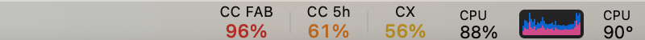
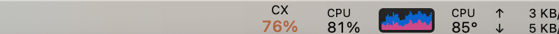
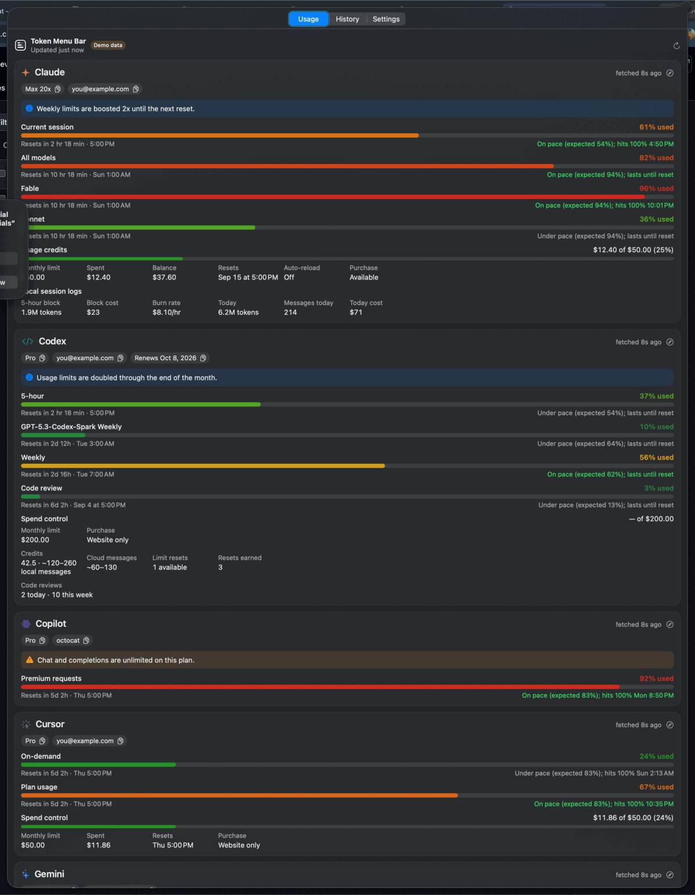
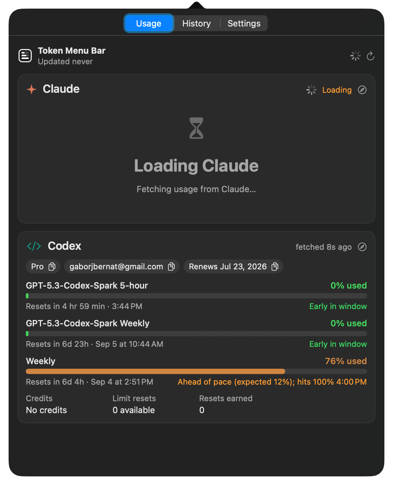
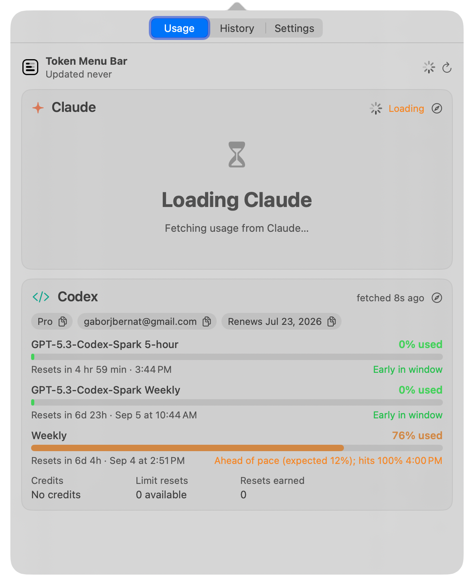
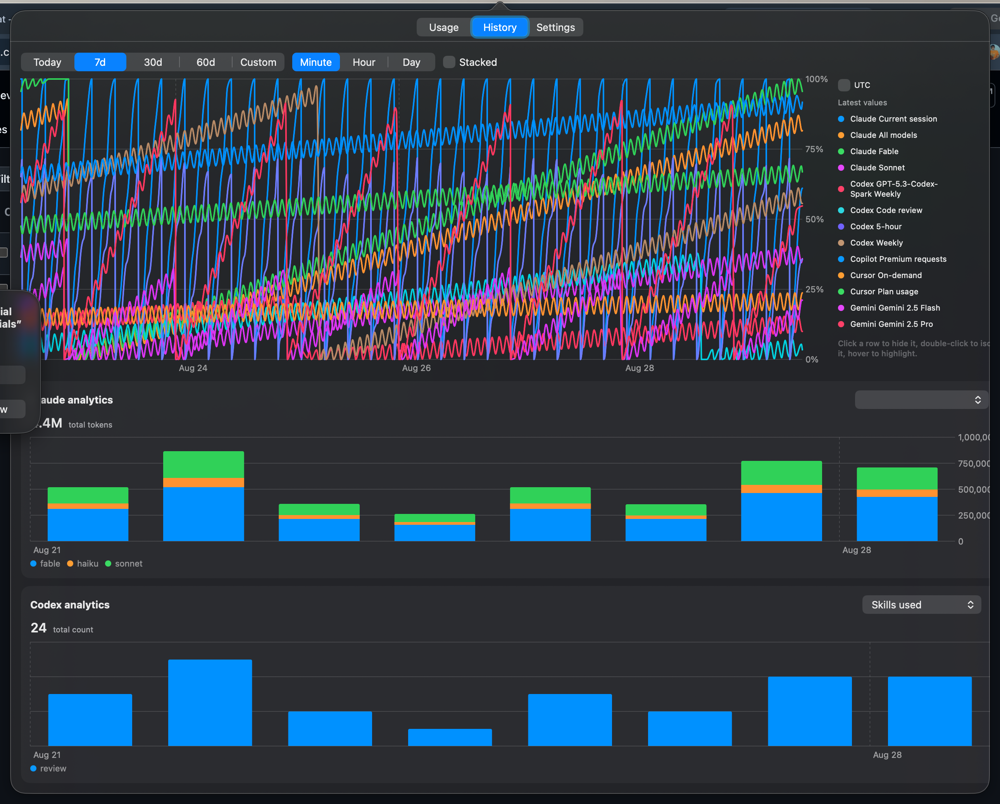
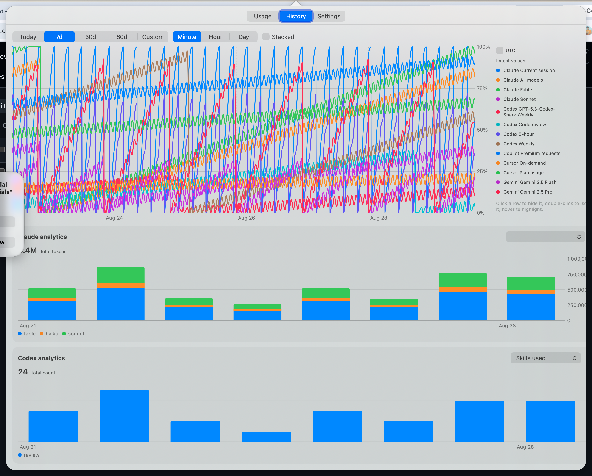

<h1 class="hero-title">Your Claude and Codex limits, one glance away</h1>

Token Menu Bar puts the plan usage that Claude Code, OpenAI Codex, Gemini CLI, Cursor and GitHub Copilot meter for you
into the macOS menu bar: session, weekly and monthly windows per model, usage credits, reset countdowns, pace
projections, notifications, desktop widgets, 60 days of history and the analytics the vendor dashboards show. It reads
the tokens those clients already store on your Mac, so there is nothing to sign into and nothing leaves your machine
except the calls to the vendors' own endpoints.

<a class="md-button md-button--primary" href="https://github.com/tox-dev/token-menu-bar-macos/releases/latest">Download for macOS 26</a>
<a class="md-button" href="install/">Install options</a>

<ul markdown="block">
<li markdown="1">
:material-speedometer:{ .lg .middle } **Every window the vendors meter**

Claude's 5-hour session and weekly per-model limits, Codex's weekly and model-specific windows, Gemini's per-model daily
buckets, Cursor's plan and on-demand spend, Copilot's premium requests, plus credits and spend caps, with the same
numbers the vendor usage pages display.

</li>
<li markdown="1">
:material-chart-timeline-variant:{ .lg .middle } **History that survives the reset**

Usage is sampled every few minutes into a local SQLite store. Charts keep 60 days, draw the reset cliffs, stack windows,
and page through custom ranges; Codex analytics and Claude's local session logs feed daily token, model, cost and
tool-call breakdowns.

</li>
<li markdown="1">
:material-bell-ring:{ .lg .middle } **Pace and notifications**

Each window shows whether you are ahead of or behind an even pace and when it would hit 100%. Threshold crossings,
resets and sign-in problems arrive as macOS notifications you can tune.

</li>
<li markdown="1">
:material-lock-outline:{ .lg .middle } **Private by construction**

No accounts, no telemetry, no token refresh unless you opt in. The App Store build runs sandboxed and asks before it
reads `~/.codex`; the direct build is notarized and updates through Sparkle.

</li>
</ul>

## Built for the menu bar

The status item shows one compact cell per window (`CC 5h 36%`, `CX 7d 62%`) and hides windows sitting at 0%. Cells are
drawn as images, so they keep two lines of text and per-value colour at any menu bar height, and they only redraw when a
value changes. When the bar runs out of room next to the notch the cells step down to narrower layouts on their own.
Click for the popover, right-click for a quick menu, or put the same windows on the desktop as a widget.

## Made to stay out of the way

- Polls Claude every 5 minutes and Codex every 2 (faster while the popover is open), with backoff when a vendor asks to
  slow down, because Anthropic's usage endpoint rate-limits after a handful of calls.
- Falls back to the Codex CLI's own session logs when you are offline or signed out, so the numbers never vanish.
- Pauses while the Mac sleeps and refreshes on wake.

<a class="md-button" href="features/">Read what each tab shows</a>
