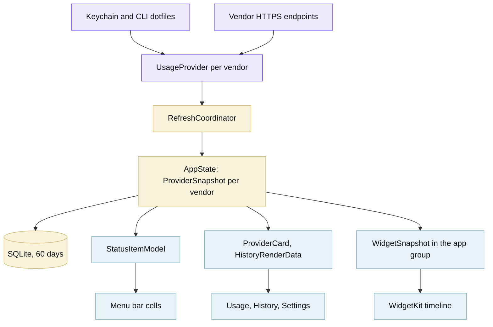
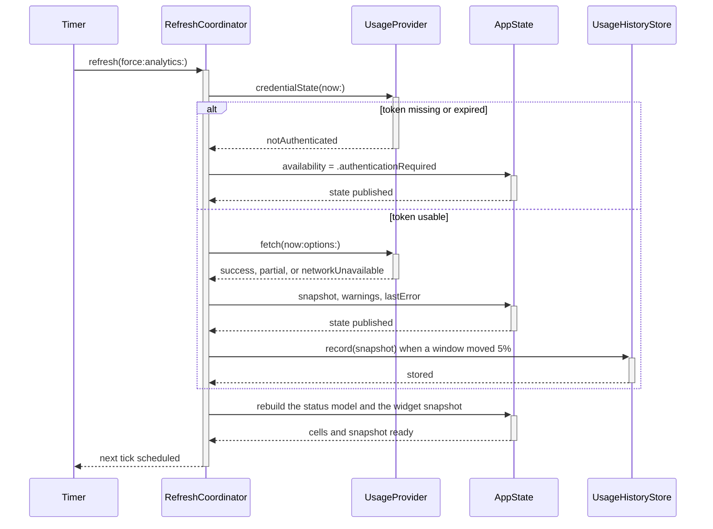
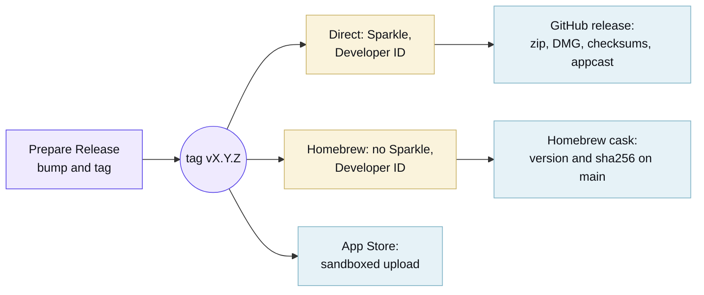

## Get the tools

[mise](https://mise.jdx.dev) pins every tool this repository needs, with checksums in `mise.lock`, and
[just](https://just.systems) drives the workflows.

```sh
git clone https://github.com/tox-dev/token-menu-bar-macos
cd token-menu-bar-macos
mise install     # hugo, just, pre-commit, xcodegen
just             # the list of workflows
just check       # build, tests with the coverage gate, and every lint hook
just run         # ad-hoc signed .app in dist/, launched
```

The Swift toolchain stays outside mise, since a release build needs [Xcode](https://developer.apple.com/xcode/) anyway.
A [swiftly](https://swiftlang.github.io/swiftly/) toolchain works for everything except the Xcode schemes. Ad-hoc builds
take a new code signature each time, so macOS repeats the Keychain prompt after every rebuild.

## How the app is put together

Three SwiftPM targets and a widget extension. Core holds every decision that does not need a screen, which is what keeps
the test suite fast and the UI thin.



- `TokenMenuBarCore` holds providers, credentials, history, presentation policy, settings, and the status-bar model. It
  uses Foundation, SQLite, Security, and OSLog; it does not import AppKit or SwiftUI.
- `TokenMenuBarUI` renders Core values through the status item, popover, and three tabs. It contains no vendor parsing.
- `TokenMenuBarWidgets` reads the snapshot that Core writes. It does not call vendors.
- `TokenMenuBar` contains `main.swift`, which parses arguments and starts the run loop.

A refresh is one pass over the registry, and a provider that fails does not stop the others.



## Adding a provider

Everything downstream of `ProviderSnapshot` is generic, so a new vendor is one conformance plus its mapping.

```mermaid
flowchart LR
    accTitle: Steps to add a provider
    accDescr: Add a ProviderID case and setup metadata, give it a polling policy and a provider mark, conform to UsageProvider, map the response to QuotaWindow and ProviderAnalytics, register it in ProviderRegistryFactory, and add a DemoData snapshot.
    A[Add a ProviderID case<br/>name, tag, setup metadata] --> B[PollingPolicy default<br/>and provider mark]
    B --> C[Conform to UsageProvider<br/>credentialState, fetch]
    C --> D[Map the response to<br/>QuotaWindow and ProviderAnalytics]
    D --> E[Register in<br/>ProviderRegistryFactory]
    E --> F[Add a DemoData snapshot]
    classDef step fill:#efeafe,stroke:#5a46e8,color:#0f1117;
    class A,B,C,D,E,F step;
```



The menu bar, popover, history, widgets and notifications then pick the provider up on their own. Record a fixture from
the live endpoint under `Tests/TokenMenuBarCoreTests/Fixtures/`, with the account details replaced, and drive the
provider's `fetch` through `StubTransport` rather than calling the mapper.

## House style

- Core owns the logic. If a rule can be decided without a screen, it belongs in `TokenMenuBarCore` with a test.
- Tests describe behaviour through public API. A mapper case feeds vendor JSON through `StubTransport` and asserts on
  the `ProviderSnapshot`, so a rename inside Core does not rewrite the suite.
- `Scripts/coverage.sh` fails when a line in Core or UI never runs. Its `glue` array is the authoritative list of files
  that require an application, framework, widget, or Xcode host. The script derives SwiftPM exclusions from that list
  and caps each file at 40 lines, so logic cannot accumulate where no test reaches.
- Comments carry the why. Anything that restates the line below it comes out.
- [swift-format](https://github.com/swiftlang/swift-format) settles layout at 120 columns; `just fmt` applies it.
- Helpers sit below their first caller, so a file reads top to bottom.
- Prose, commit messages and UI copy avoid the AI writing tells: no filler adverbs, no passive voice hiding the actor,
  no sweeping every/never claims that nothing enforces.

## Refreshing the docs screenshots

```sh
just shots
```

The app renders the shots itself: `--export-menubar` and `--export-popover` draw the status strip and each popover tab
on demo data, at the size the tab reports, in light and dark. Nothing captures the screen, so a shot carries no part of
your desktop and no part of your account.

These exports do not create an `NSPopover` or a window-server surface. They cannot verify the arrow, control bezels,
focus rings, screen selection, or top-edge anchoring.

## Verifying the live panel

Run this check on macOS 14, 15, 26, and 27 before a release:

```sh
just run
```

`just run` uses provider data from the current account. Use `just run-demo` for seeded providers, a separate defaults
suite, and a temporary support directory.

1. Open the status item near the left edge, centre, and right edge of the menu bar. The arrow must meet the status item
   at each position.
2. Switch through Usage, History, and Settings. The panel's top edge and width must stay fixed while its bottom edge
   moves. Repeat on a short display and a secondary display with a different scale.
3. Make each tab exceed the screen height. The body must scroll without clipping the tab control or moving the arrow.
4. Press each action button. It must show a bezel, pressed state, and non-accent label. Check light, dark, increased
   contrast, and reduced transparency appearances.
5. Enable Keyboard navigation under System Settings > Keyboard. Use Tab and Shift-Tab to reach each control, Command-R
   to refresh, Command-F to focus the Settings model filter, and Escape to close the panel. Focus rings must remain
   visible.
6. Leave the panel open for two minutes. Activity Monitor should show stable memory and no sustained CPU work while the
   data remains unchanged.

The application UI suite checks all three tabs for accessibility faults, enforces launch, memory, and idle-CPU budgets,
and removes its defaults and support files after each test. Xcode 27 jobs verify the SDK but do not claim macOS 27
runtime coverage. The required **macOS 27 runtime** status stays red until `MACOS_27_RUNTIME_RUNNER` names a self-hosted
Mac running macOS 27; releases use the same runner.

## The website

`website/` is a self-contained [Hugo](https://gohugo.io) site built from plain CSS and templates, with no theme module,
Node or Sass. Its structure follows [Diátaxis](https://diataxis.fr): a tutorial, a reference, an explanation, and this
page.

```sh
just site-serve
```

The brand lives in two places that have to stay in step: `Sources/TokenMenuBarCore/Brand.swift` for the app, and the
custom properties at the top of `website/assets/css/site.css` for the site. `website/static/brand/` holds the logo files
(`mark`, `mark-mono`, `lockup`, `lockup-stacked`, `icon`, `seal`). Each page also ships as raw markdown next to itself,
and `/llms.txt` indexes them for crawlers in the [llms.txt](https://llmstxt.org) format.

Diagrams are [Mermaid](https://mermaid.js.org) fenced blocks. The renderer loads only on pages that hold one, and takes
its palette from the site tokens, so a diagram follows the light and dark themes.

## Releasing

One button: run the **Prepare Release** workflow (`just release patch|minor|major`, or the Actions tab). It works out
the next version from the newest tag and pushes `vX.Y.Z` with a token of its own, because a tag pushed with the default
`GITHUB_TOKEN` starts no further workflow.

That tag triggers **Release**, and one run publishes all three channels:



The direct leg refuses to run without its credentials, so a tag never publishes an app Gatekeeper rejects or a feed
[Sparkle](https://sparkle-project.org) cannot verify. The App Store leg checks its own credentials first and skips with
a note in the run summary when they are missing, so the rest of a release still ships while the Apple Developer account
is pending.

The three channels are separate Xcode application targets. Only Direct compiles and links `SparkleUpdater`; Homebrew and
App Store do not link the Sparkle product and carry no Sparkle keys in `Info.plist`. Release verification checks both
arm64 and x86_64 slices, Mach-O validity, and updater load commands in the app, zip, and disk image without launching
the application.

### What Apple needs

Enrol in the [Apple Developer Program](https://developer.apple.com/programs/), then create these and store each in the
`release`
[environment](https://docs.github.com/en/actions/how-tos/deploy/configure-and-manage-deployments/manage-environments),
which only `main` and `v*` tags can deploy to. Every job that reads a signing identity names that environment, so a pull
request build cannot reach one:

- `DEVELOPER_ID_CERTIFICATE_BASE64` and `DEVELOPER_ID_CERTIFICATE_PASSWORD`: a **Developer ID Application** certificate
  exported from Keychain Access as a base64-encoded `.p12`.
- `APPLE_DISTRIBUTION_CERTIFICATE_BASE64` and `APPLE_DISTRIBUTION_CERTIFICATE_PASSWORD`: an **Apple Distribution**
  certificate exported the same way.
- `MAC_INSTALLER_DISTRIBUTION_CERTIFICATE_BASE64` and `MAC_INSTALLER_DISTRIBUTION_CERTIFICATE_PASSWORD`: a **Mac
  Installer Distribution** certificate exported the same way.
- `APP_STORE_PROVISIONING_PROFILE_BASE64` and `APP_STORE_WIDGET_PROVISIONING_PROFILE_BASE64`: Mac App Store profiles for
  `dev.tox.token-menu-bar` and its widget extension.
- `APPLE_TEAM_ID`: the ten-character identifier on the [membership page](https://developer.apple.com/account).
- `APP_STORE_CONNECT_KEY_ID`, `APP_STORE_CONNECT_ISSUER_ID`, and `APP_STORE_CONNECT_KEY_BASE64`: a base64-encoded
  [App Store Connect API key](https://appstoreconnect.apple.com/access/integrations/api) with the App Manager role.
- `SPARKLE_PUBLIC_ED_KEY` and `SPARKLE_PRIVATE_ED_KEY`: keys from Sparkle's `generate_keys` command.

The app record in [App Store Connect](https://appstoreconnect.apple.com) has to exist under the same bundle identifier
before the first upload, along with a `dev.tox.token-menu-bar` App ID and an app group for the widget.

[Renovate](https://docs.renovatebot.com) opens a grouped pull request each week for the pinned tools, the action digests
and the Swift packages. The docs deploy to GitHub Pages on every push to `main`.
