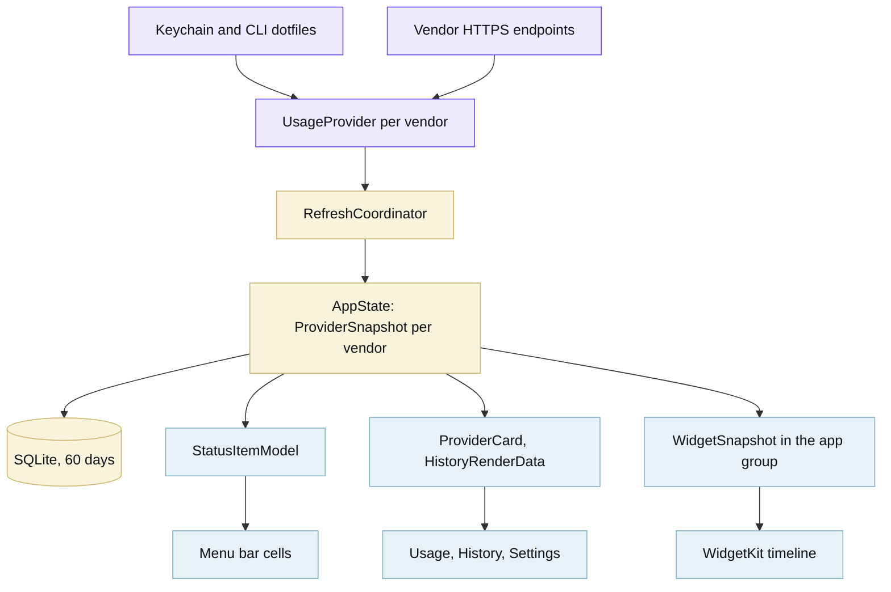
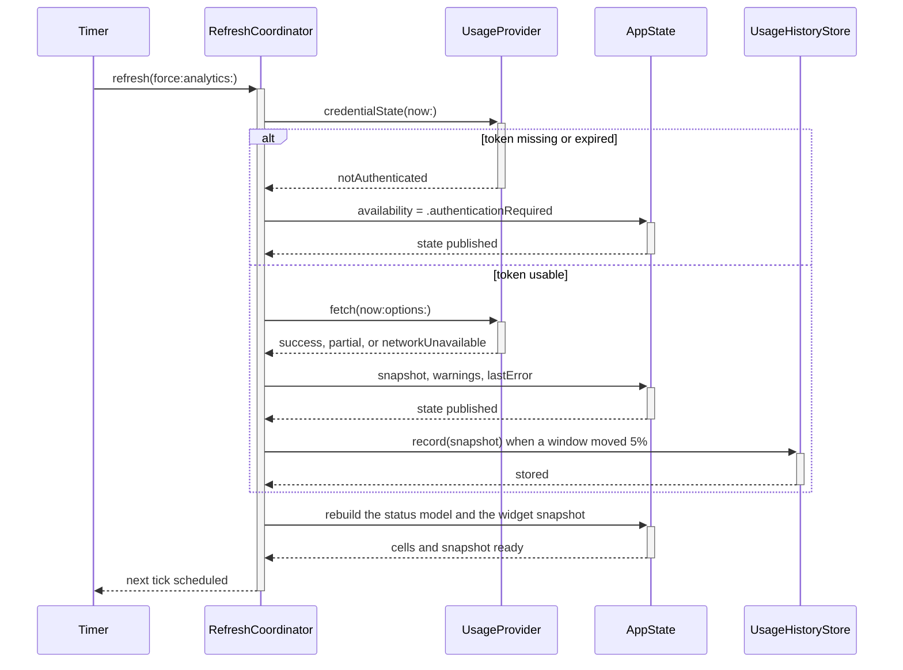
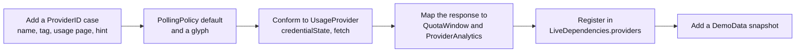

## Get the tools

[mise](https://mise.jdx.dev) pins every tool this repository needs, with checksums in `mise.lock`, and
[just](https://just.systems) drives the workflows.

```sh
git clone https://github.com/tox-dev/token-menu-bar-macos
cd token-menu-bar-macos
mise install     # hugo, just, pre-commit, xcodegen
just             # the list of workflows
just check       # build, tests with the coverage gate, and every lint hook
just run         # ad-hoc signed .app in dist/, launched
```

The Swift toolchain stays outside mise, since a release build needs [Xcode](https://developer.apple.com/xcode/) anyway.
A [swiftly](https://swiftlang.github.io/swiftly/) toolchain works for everything except the Xcode schemes. Ad-hoc builds
take a new code signature each time, so macOS repeats the Keychain prompt after every rebuild.

## How the app is put together

Three SwiftPM targets and a widget extension. Core holds every decision that does not need a screen, which is what keeps
the test suite fast and the UI thin.



| Target                | Holds                                                                                            | Rule                                                               |
| --------------------- | ------------------------------------------------------------------------------------------------ | ------------------------------------------------------------------ |
| `TokenMenuBarCore`    | providers, credentials, history, chart pipeline, pace, notifications, settings, status-bar model | Foundation, SQLite, Security and OSLog only. No AppKit, no SwiftUI |
| `TokenMenuBarUI`      | status item rendering, popover, the three tabs, app composition                                  | Renders Core value types. No vendor knowledge, no parsing          |
| `TokenMenuBarWidgets` | the WidgetKit timeline and its views                                                             | Reads the snapshot Core writes; never calls a vendor               |
| `TokenMenuBar`        | `main.swift`                                                                                     | Argument parsing and the run loop, nothing else                    |

A refresh is one pass over the registry, and a provider that fails does not stop the others.



## Adding a provider

Everything downstream of `ProviderSnapshot` is generic, so a new vendor is one conformance plus its mapping.



The menu bar, popover, history, widgets and notifications then pick the provider up on their own. Record a fixture from
the live endpoint under `Tests/TokenMenuBarCoreTests/Fixtures/`, with the account details replaced, and drive the
provider's `fetch` through `StubTransport` rather than calling the mapper.

## House style

- Core owns the logic. If a rule can be decided without a screen, it belongs in `TokenMenuBarCore` with a test.
- Tests describe behaviour through public API. A mapper case feeds vendor JSON through `StubTransport` and asserts on
  the `ProviderSnapshot`, so a rename inside Core does not rewrite the suite.
- `Scripts/coverage.sh` fails when a line in Core or UI never runs. The five files it cannot measure (`main.swift`, the
  LaunchServices and WidgetKit glue, and the two under `App/`) are capped at 40 lines each, so logic cannot accumulate
  where no test reaches.
- Comments carry the why. Anything that restates the line below it comes out.
- [swift-format](https://github.com/swiftlang/swift-format) settles layout at 120 columns; `just fmt` applies it.
- Helpers sit below their first caller, so a file reads top to bottom.
- Prose, commit messages and UI copy avoid the AI writing tells: no filler adverbs, no passive voice hiding the actor,
  no sweeping every/never claims that nothing enforces.

## Refreshing the docs screenshots

```sh
just shots
```

The app renders the shots itself: `--export-menubar` and `--export-popover` draw the status strip and each popover tab
on demo data, at the size the tab reports, in light and dark. Nothing captures the screen, so a shot carries no part of
your desktop and no part of your account.

## The website

`website/` is a self-contained [Hugo](https://gohugo.io) site built from plain CSS and templates, with no theme module,
Node or Sass. Its structure follows [Diátaxis](https://diataxis.fr): a tutorial, a reference, an explanation, and this
page.

```sh
just site-serve
```

The brand lives in two places that have to stay in step: `Sources/TokenMenuBarCore/Brand.swift` for the app, and the
custom properties at the top of `website/assets/css/site.css` for the site. `website/static/brand/` holds the logo files
(`mark`, `mark-mono`, `lockup`, `lockup-stacked`, `icon`, `seal`). Each page also ships as raw markdown next to itself,
and `/llms.txt` indexes them for crawlers in the [llms.txt](https://llmstxt.org) format.

Diagrams are [Mermaid](https://mermaid.js.org) fenced blocks. The renderer loads only on pages that hold one, and takes
its palette from the site tokens, so a diagram follows the light and dark themes.

## Releasing

Tag `vX.Y.Z`. The release workflow builds the direct app, signs and notarizes it when the secrets exist, publishes the
zip, DMG, checksums and [Sparkle](https://sparkle-project.org) appcast, refreshes the
[Homebrew cask](https://docs.brew.sh/Cask-Cookbook), and uploads the App Store flavour when the `APP_STORE_ENABLED`
variable is set. The signed builds carry the widget extension; an ad-hoc development bundle has none.

Secrets the workflow understands: `DEVELOPER_ID_CERTIFICATE_BASE64`, `DEVELOPER_ID_CERTIFICATE_PASSWORD`,
`APPLE_DISTRIBUTION_CERTIFICATE_BASE64`, `APPLE_DISTRIBUTION_CERTIFICATE_PASSWORD`,
`APP_STORE_PROVISIONING_PROFILE_BASE64`, `APPLE_TEAM_ID`, `APP_STORE_CONNECT_KEY_ID`, `APP_STORE_CONNECT_ISSUER_ID`,
`APP_STORE_CONNECT_KEY_BASE64`, `SPARKLE_PUBLIC_ED_KEY`, `SPARKLE_PRIVATE_ED_KEY`.

[Renovate](https://docs.renovatebot.com) opens a grouped pull request each week for the pinned tools, the action digests
and the Swift packages. The docs deploy to GitHub Pages on every push to `main`.
