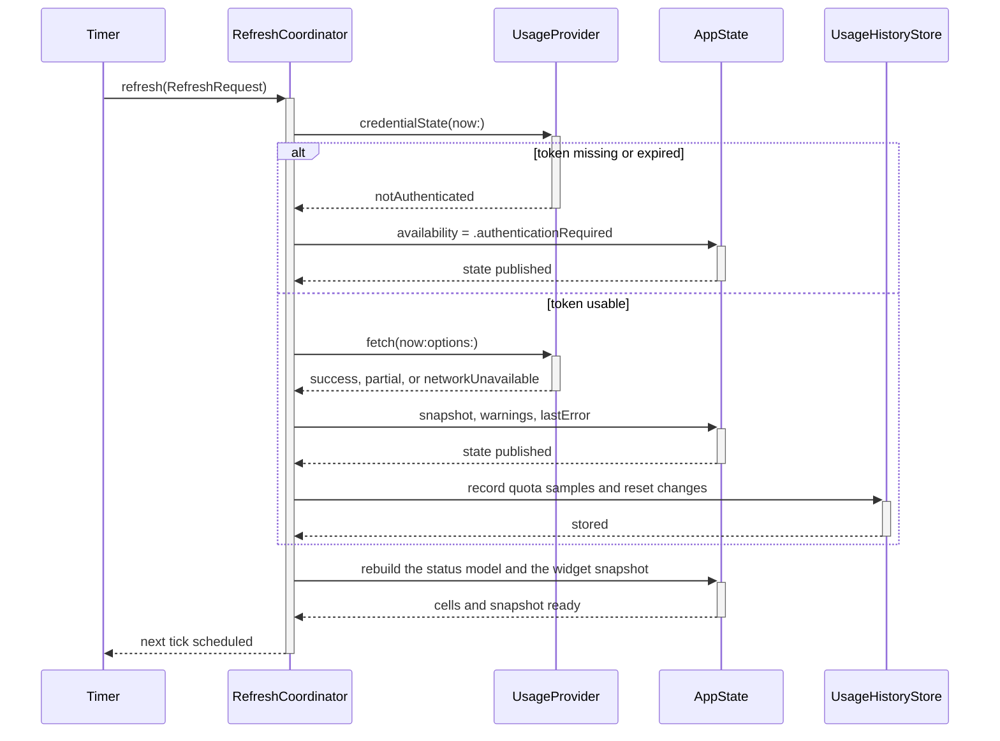

## Targets and refresh flow

The executable, Core, UI and Widgets have separate targets. Core owns decisions that do not require a screen.

```mermaid
flowchart TD
    accTitle: Data flow through the four targets
    accDescr: The Keychain, the CLI dotfiles and the vendor endpoints feed one UsageProvider per vendor. RefreshCoordinator drives them and writes AppState, which fans out to the SQLite history, the menu bar status model, the popover cards and the widget snapshot.
    Keychain[Keychain and CLI dotfiles] --> Providers
    Vendors[Vendor HTTPS endpoints] --> Providers
    Providers[UsageProvider per vendor] --> Coordinator[RefreshCoordinator]
    Coordinator --> State[AppState: ProviderSnapshot per vendor]
    State --> History[(SQLite, 60 days)]
    State --> Status[StatusItemModel]
    State --> Cards[ProviderCard, HistoryRenderData]
    Status --> Bar[Menu bar cells]
    Cards --> Popover[Usage, History, Settings]
    State --> Widget[WidgetSnapshot in the app group]
    Widget --> Widgets[WidgetKit timeline]
    classDef source fill:#efeafe,stroke:#5a46e8,color:#0f1117;
    classDef core fill:#faf3dc,stroke:#cbb46a,color:#0f1117;
    classDef sink fill:#e6f2f7,stroke:#7fb3c6,color:#0f1117;
    class Keychain,Vendors,Providers source;
    class Coordinator,State,History core;
    class Status,Cards,Bar,Popover,Widget,Widgets sink;
```

- `TokenMenuBarCore` holds providers, credentials, history, presentation policy, settings, and the status-bar model. It
  uses Foundation, SQLite, Security, and OSLog; it does not import AppKit or SwiftUI.
- `TokenMenuBarUI` renders Core values through the status item, popover, and three tabs. It contains no vendor parsing.
- `TokenMenuBarWidgets` reads the snapshot that Core writes. It does not call vendors.
- `TokenMenuBar` contains `main.swift`, which parses arguments and starts the run loop.

A refresh is one pass over the registry, and a provider that fails does not stop the others.

## House style

- Core owns the logic. If a rule can be decided without a screen, it belongs in `TokenMenuBarCore` with a test.
- Tests describe behaviour through public API. A mapper case feeds vendor JSON through `StubTransport` and asserts on
  the `ProviderSnapshot`, so a rename inside Core does not rewrite the suite.
- CI runs `Scripts/coverage.sh`, which fails when a line in Core or UI never runs. Its `glue` array lists the files that
  require an application, framework, widget, or Xcode host. The script derives SwiftPM exclusions from that list and
  caps each file at 40 lines. Keep decisions in tested Core code rather than adding a coverage exclusion.
- Comments carry the why. Anything that restates the line below it comes out.
- [swift-format](https://github.com/swiftlang/swift-format) settles layout at 120 columns; `just fmt` applies it.
- Helpers sit below their first caller, so a file reads top to bottom.
- Prose, commit messages and UI copy avoid the AI writing tells: no filler adverbs, no passive voice hiding the actor,
  no sweeping every/never claims that nothing enforces.
