Start with the provider contract and mapping, then register discovery, polling and presentation metadata.

```mermaid
flowchart LR
    accTitle: Steps to add a provider
    accDescr: Add a ProviderID case and setup metadata, give it a polling policy and a provider mark, conform to UsageProvider, map the response to QuotaWindow and ProviderAnalytics, register it in ProviderRegistryFactory, and add a DemoData snapshot.
    A[Add a ProviderID case<br/>name, tag, setup metadata] --> B[PollingPolicy default<br/>and provider mark]
    B --> C[Conform to UsageProvider<br/>credentialState, fetch]
    C --> D[Map the response to<br/>QuotaWindow and ProviderAnalytics]
    D --> E[Register in<br/>ProviderRegistryFactory]
    E --> F[Add a DemoData snapshot]
    classDef step fill:#efeafe,stroke:#5a46e8,color:#0f1117;
    class A,B,C,D,E,F step;
```

Add synthetic response fixtures under `Tests/TokenMenuBarCoreTests/Fixtures/` and drive the provider's `fetch` through
`StubTransport`. Cover absent and zero fields, expired credentials, account changes and rate limits. Do not read a
developer's accounts or contact a live provider to run tests. Register supplier attribution and demo data where the new
provider supports analytics.
