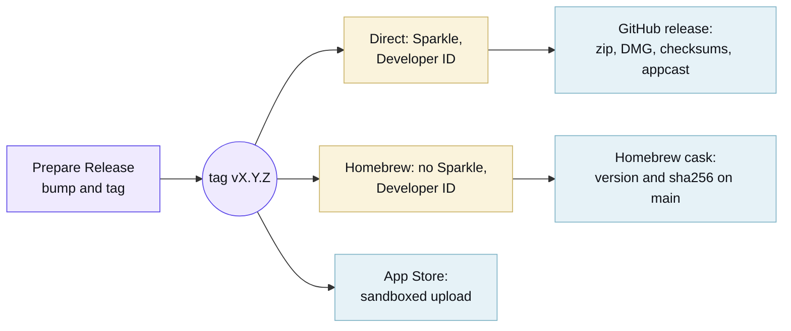

Run the **Prepare Release** workflow (`just release patch|minor|major`, or the Actions tab). It works out the next
version from the newest tag and pushes `vX.Y.Z` with a token of its own, because a tag pushed with the default
`GITHUB_TOKEN` starts no further workflow.

That tag triggers **Release**, and one run publishes all three channels:

The Direct job requires signing credentials and [Sparkle](https://sparkle-project.org) keys. The App Store job checks
its credentials and skips with a note in the run summary if they are missing. Direct and Homebrew releases can proceed
while the App Store account is pending.

The first release is still in development. Pipeline configuration is not evidence that a release or App Store listing
exists. Check the repository's releases and full PR CI matrix before declaring a build ready. Require the deployed macOS
14, 15 and 26 checks. Add actual macOS 27 acceptance after its runner image rollout.

The three channels are separate Xcode application targets. Only Direct compiles and links `SparkleUpdater`; Homebrew and
App Store do not link the Sparkle product and carry no Sparkle keys in `Info.plist`. Release verification checks both
arm64 and x86_64 slices, Mach-O validity, and updater load commands in the app, zip, and disk image without launching
the application.

### What Apple needs

Enrol in the [Apple Developer Program](https://developer.apple.com/programs/), then create these and store each in the
`release`
[environment](https://docs.github.com/en/actions/how-tos/deploy/configure-and-manage-deployments/manage-environments),
which only `main` and `v*` tags can deploy to. Every job that reads a signing identity names that environment, so a pull
request build cannot reach one:

- `DEVELOPER_ID_CERTIFICATE_BASE64` and `DEVELOPER_ID_CERTIFICATE_PASSWORD`: a **Developer ID Application** certificate
  exported from Keychain Access as a base64-encoded `.p12`.
- `APPLE_DISTRIBUTION_CERTIFICATE_BASE64` and `APPLE_DISTRIBUTION_CERTIFICATE_PASSWORD`: an **Apple Distribution**
  certificate exported the same way.
- `MAC_INSTALLER_DISTRIBUTION_CERTIFICATE_BASE64` and `MAC_INSTALLER_DISTRIBUTION_CERTIFICATE_PASSWORD`: a **Mac
  Installer Distribution** certificate exported the same way.
- `APP_STORE_PROVISIONING_PROFILE_BASE64` and `APP_STORE_WIDGET_PROVISIONING_PROFILE_BASE64`: Mac App Store profiles for
  `dev.tox.token-menu-bar` and its widget extension.
- `APPLE_TEAM_ID`: the ten-character identifier on the [membership page](https://developer.apple.com/account).
- `APP_STORE_CONNECT_KEY_ID`, `APP_STORE_CONNECT_ISSUER_ID`, and `APP_STORE_CONNECT_KEY_BASE64`: a base64-encoded
  [App Store Connect API key](https://appstoreconnect.apple.com/access/integrations/api) with the App Manager role.
- `SPARKLE_PUBLIC_ED_KEY` and `SPARKLE_PRIVATE_ED_KEY`: keys from Sparkle's `generate_keys` command.

The app record in [App Store Connect](https://appstoreconnect.apple.com) has to exist under the same bundle identifier
before the first upload, along with a `dev.tox.token-menu-bar` App ID and an app group for the widget.

[Renovate](https://docs.renovatebot.com) opens a grouped pull request each week for the pinned tools, the action digests
and the Swift packages. Read the Docs publishes the site using `.readthedocs.yaml`; the Website workflow validates a
build. Preview and versioned URLs include a base path, so internal links must use Hugo page URLs.
